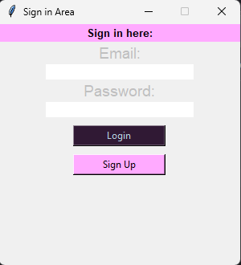
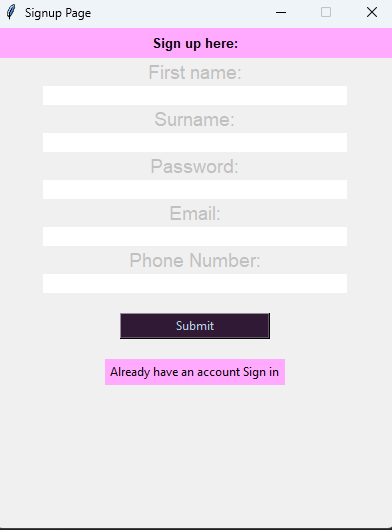
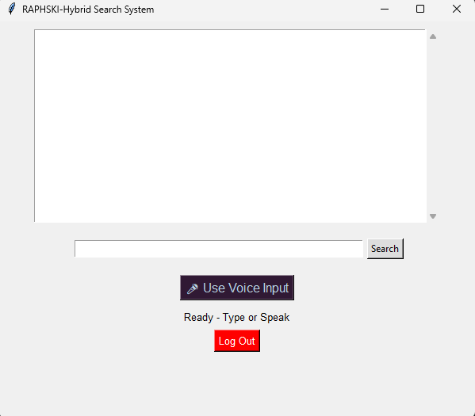
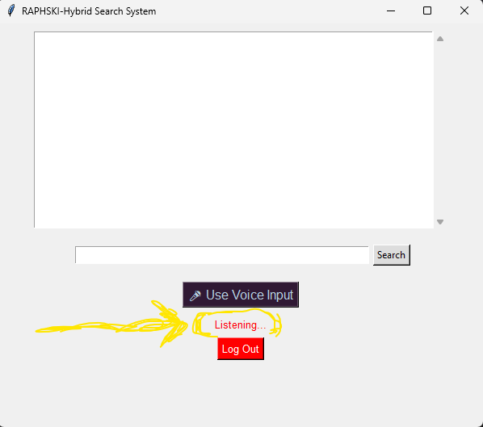

# RAPHSKI — Hybrid AI Desktop Assistant

RAPHSKI is a Python-based hybrid AI desktop assistant that combines voice interaction, GUI systems, web automation, authentication, and intelligent assistant architecture into a single desktop application.

The project is designed as a scalable assistant platform capable of evolving into a fully conversational AI system with NLP, memory, and local AI integration.

---

# Features

✔ Voice recognition and speech response
✔ Hybrid text + voice interaction
✔ Desktop GUI interface using Tkinter
✔ User authentication system
✔ SQLite database integration
✔ Web automation and browser control
✔ Multithreaded voice processing
✔ Modular assistant architecture
✔ Google search fallback system

---

# System Architecture

```text
User Input
   ↓
Voice/Text Interface
   ↓
Processing Engine
   ↓
Command Routing
   ↓
Action Execution
   ↓
Voice/Text Response
```

---

# Technologies Used

* Python
* Tkinter
* SQLite
* SpeechRecognition
* pyttsx3
* PyAudio
* threading
* webbrowser
* subprocess

---

# Project Structure

```text
RAPHSKI-AI-Assistant/
│
├── assets/
│   ├── signin.png
│   ├── signup.png
│   ├── main_interface.png
│   └── voice_mode.png
│
├── main.py
├── sign_in.py
├── sign_up.py
├── voice_engine.py
├── setup_database.py
├── README.md
└── requirements.txt
```

---

# Current Capabilities

## Voice Assistant

RAPHSKI can:

* listen to voice commands
* convert speech to text
* respond using text-to-speech
* process both typed and spoken input

## Hybrid Search System

The assistant:

* handles internal commands directly
* falls back to Google search for unknown queries

## Authentication System

Includes:

* sign up page
* sign in page
* SQLite user database
* user data persistence

## GUI System

Built using Tkinter with:

* responsive interface
* status updates
* multithreaded voice handling
* multiple application windows

---

# Future Roadmap

Planned upgrades include:

* NLP intent classification
* Conversational memory system
* User personalization
* Local LLM integration
* Offline speech recognition
* Wake-word activation
* Plugin architecture
* Semantic search
* AI reasoning engine

---

# Why RAPHSKI?

RAPHSKI was built as more than a simple assistant project.

The goal is to explore:

* AI assistant engineering
* voice systems
* NLP architecture
* intelligent automation
* scalable desktop assistant design

This project represents the foundation of a future conversational AI ecosystem.

---

# Installation

## 1. Clone the Repository

```bash
git clone https://github.com/yourusername/RAPHSKI-AI-Assistant.git
cd RAPHSKI-AI-Assistant
```

## 2. Install Dependencies

```bash
pip install -r requirements.txt
```

## 3. Run Database Setup

```bash
python setup_database.py
```

## 4. Launch RAPHSKI

```bash
python main.py
```

---

# Requirements

Example packages required:

```text
SpeechRecognition
pyttsx3
pyaudio
```

---

# Screenshots

## Sign In Page


## Sign Up Page


## Main Interface


## Voice Interaction

---

# Developer

Rapheal Enang

Python Developer | AI Assistant Engineer | Voice & NLP Systems Builder

---

# License

This project is open-source and available under the MIT License.
